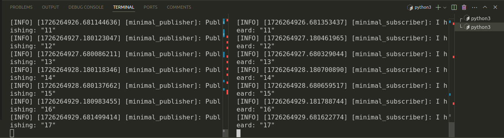
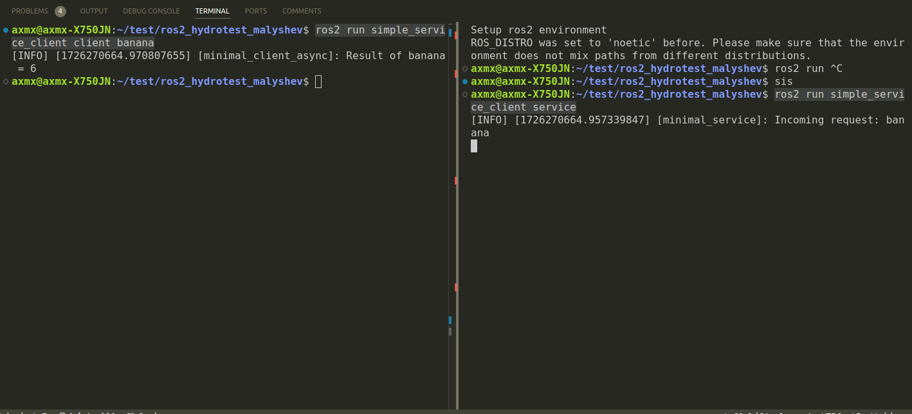

# ros2_hydrotest_malyshev
Package for passing test in hidronautics BMSTU team

# How to launch publisher and subscriber

```
cd ros2_hydrotest_malyshev
colcon build
source install/setup.bash
ros2 run simple_publisher_subscriber publisher
```
Open new terminal
```
source install/setup.bash
ros2 run simple_publsiher_subscriber subscriber
```

You should see similar output:



# How to launch service and client

```
cd ros2_hydrotest_malyshev
colcon build
source install/setup.bash
ros2 run simple_service_client service
```
Open new terminal
```
source install/setup.bash
ros2 run simple_service_client client banana # You can choose any word instead of banana
```

You should see similar output:



# How to use launch file
```
cd ros2_hydrotest_malyshev
colcon build
source install/setup.bash
ros2 launch simple_publisher_subscriber example_launch.py 
```
